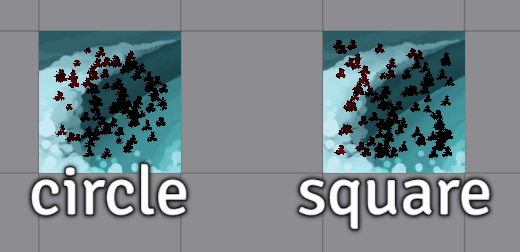

# [TokenMagic Automatic Wounds](https://foundryvtt.com/packages/tokenmagic-automatic-wounds/)

  

Will automatically apply TokenMagic visual effects of wounds to tokens based on the number of wounds on the token.
Healing will reduce wounds.

To install, browse for it in the module browser,
or [directly copy the manifest link for the latest release](https://github.com/shemetz/tokenmagic-automatic-wounds/releases/latest/download/module.json)
.

# Features

- Whenever an actor is dealt damage, a "repeatable splash wound" special effect will be applied to the token, making it
  look like an open wound has appeared.
- Wounds will appear in a random circle position on the token, with size depending on the amount of damage dealt.
- Healing applied to the actor will make existing wounds shrink or disappear, depending on amount of healing.
- (Configurable) Wound colors is red by default.
- (Configurable) All wounds will disappear when a token is fully healed.

# Supported systems (in alphabetical order)

- Alien RPG
- Cyberpunk RED (cyberpunk-red-core)
- Delta Green (deltagreen)
- Dungeon World (dungeonworld)
- D&D 4e (dnd4e)
- D&D 5e (dnd5e)
- Earthdawn 4e
- Everyday Heroes
- HeXXen 1733 (hexxen-1733)
- Old School Essentials (ose)
- Pathfinder 1e (pf1)
- Pathfinder 2e (pf2e)
- PBTA - not everything, but yes to:
    - Monster of the Week
    - World of Dungeons
    - Dungeon Bitches
- Savage Worlds Adventure Edition (SWADE)
- Tormenta20
- Shadowdark RPG
- Warhammer Fantasy Roleplay 4e (wfrp4e)

More can be added easily by request / PR!

## Settings

There is a setting to "Clear wounds on full heal"; this is because wound size from damage and wound reduction from
healing don't exactly match 1-to-1 (because it would be hard to get them to). So, there's a chance a token could be
dealt a series of damaging and healing actions, culminating in it having some large visible wounds, but nearly full HP.
By keeping this setting on, you will ensure that all blood on the token will disappear once the final hit point is
restored and the token is fully healthy again.

There is a setting to change the spread of wound placement from circle to square; useful for the few players who prefer
to use square shaped tokens in their games.

# Macros (in "TokenMagic Automatic Wounds" compendium pack)

#### Change Blood Color

Will set the current token's actor's blood color to the specified color (affecting existing wounds).

#### Reapply Wounds Based On Current HP

Will remove any existing wounds on the selected token(s) and then create new wounds that fit the tokens' HP.

#### Toggle Auto-Wounds For Token

Will disable this module's functionality for a specific token, and remove existing wounds.

#### Toggle Auto-Wounds For Actor

Same as the above, except it will apply to the original actor even if the token is not linked. This is useful for
monsters, which may default to unlinked.
