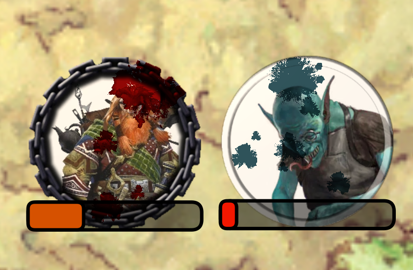

# [TokenMagic Automatic Wounds](https://foundryvtt.com/packages/tokenmagic-automatic-wounds/)

  

Will automatically apply TokenMagic visual effects of wounds to tokens based on the number of wounds on the token.

Healing will reduce wounds.

To install, browse for it in the module browser, or [directly copy the manifest link for the latest release](https://github.com/itamarcu/tokenmagic-automatic-wounds/releases/latest/download/module.json).

# Features

- Whenever an actor is dealt damage, a "repeatable splash wound" special effect will be applied to the token, making it
look like an open wound has appeared.
- Wounds will appear in a random circle position on the token, with size depending on the amount of damage dealt.
- Healing applied to the actor will make existing wounds shrink or disappear, depending on amou of healing.
- (Configurable) Wound colors is red by default.
- (Configurable) All wounds will disappear when a token is fully healed.

# Macros (in "TokenMagic Automatic Wounds" compendium pack)

#### Change Blood Color

Will set the current token's actor's blood color to the specified color (affecting existing wounds).

Note that due to a TokenMagic bug ([#184](https://github.com/Feu-Secret/Tokenmagic/issues/184)), this will not work with
colors that are too dark.

#### Reapply Wounds Based On Current HP

Will remove any existing wounds on the selected token(s) and then create new wounds that fit the tokens' HP.

#### Toggle Auto-Wounds For Token

Will disable this module's functionality for a specific token, and remove existing wounds.

#### Toggle Auto-Wounds For Actor

Same as the above, except it will apply to the original actor even if the token is not linked.  This is useful for
monsters, which may default to unlinked.
